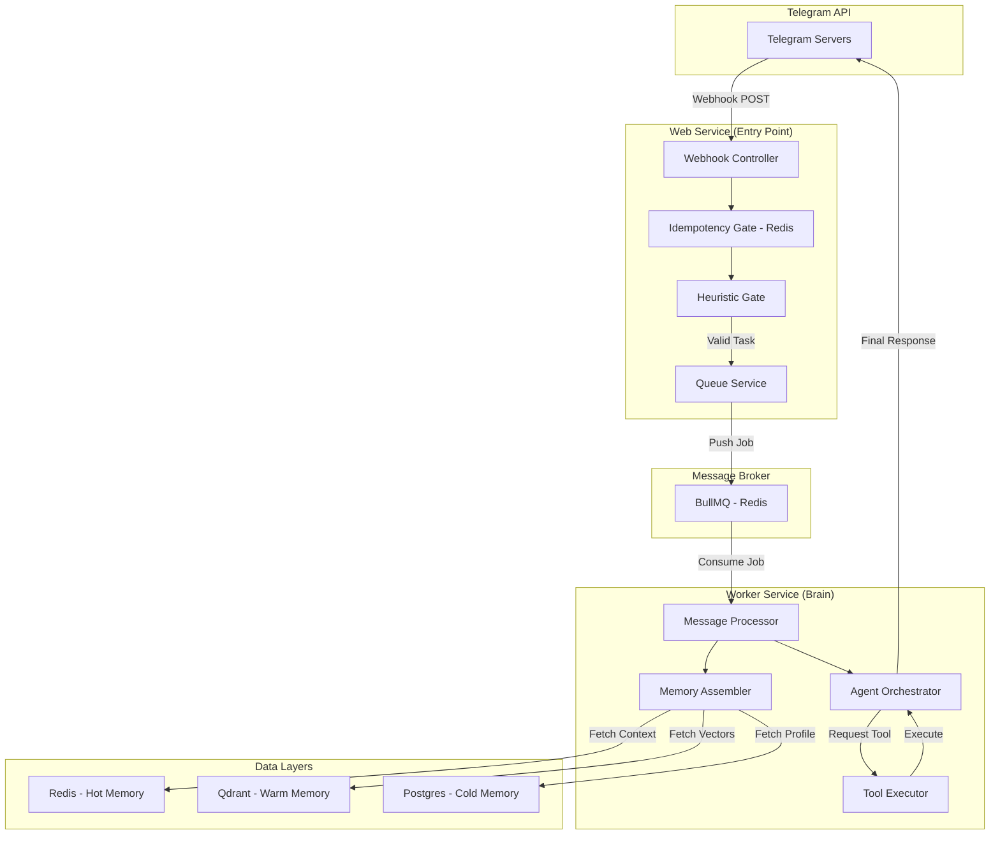
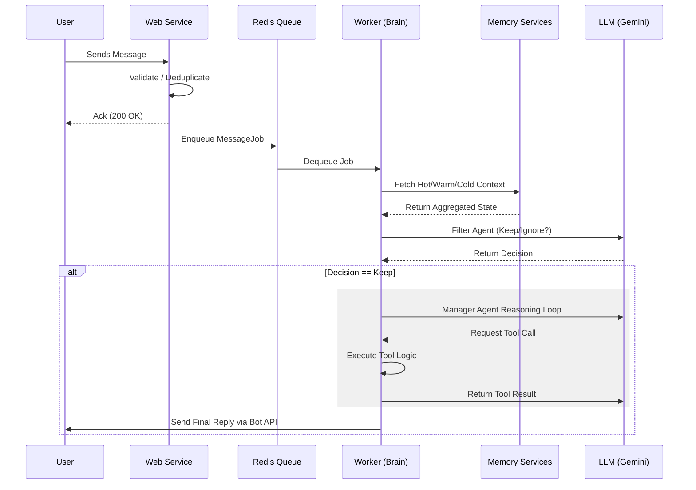

# Elena - Deep Dive: Technical Architecture and Core Systems

This document provides a comprehensive technical analysis of Elena's internal architecture, control flows, and core logic. It is intended for senior technical personnel to understand the system's operational design and extensibility patterns.

---

## System Architecture

Elena follows a multi-process asynchronous architecture designed to decouple input reception from heavy AI processing.

### High-Level Architecture

### Core Logic Principles
1. **Asynchronous Reasoning**: All LLM-based decision making is handled by background workers. The incoming webhook is acknowledged within 200ms to avoid Telegram retry storms.
2. **Context-Rich Injections**: Instead of relying solely on chat history, Elena injects semantic RAG results and user profile metadata directly into the system instruction block.
3. **Specialist Delegation**: The Manager agent acts as a router, utilizing specialized agents (Coder, Researcher, Reviewer, Brainstormer) with narrow toolsets to increase reliability.

---

## Message Execution Pipeline

The execution flow for a single user message follows a deterministic state transition:

---

## Core Systems Analysis

### 1. Agents and Orchestration
Agents are implemented using the `BaseAgent` class, which manages context window constraints and the autonomous reasoning loop.

- **MANAGER_AGENT**: Coordinates overall strategy and specialist delegation.
- **FILTER_AGENT**: Optimized for low-latency routing, utilizing technical keyword heuristics (Active Listening). Uses `gemini-3.1-flash-lite-preview`.
- **ONBOARDING_AGENT**: Manages the multi-stage interview state machine for new users.
- **CODER_SPECIALIST**: High-context agent with access to technical documentation and code analysis tools.

### 2. Tiered Memory Management
Context is segmented into three performance tiers:
- **Hot Memory (Redis)**: Sliding window of the last 15 messages with a 2-hour TTL. Ensures conversational continuity.
- **Warm Memory (Qdrant)**: Embeddings-based retrieval (Gemini-embedding-001) for historical knowledge and technical documentation.
- **Cold Memory (PostgreSQL)**: Persistent records for users, roles, and bounty status managed via Prisma.

### 3. Tool Execution Engine
The `ExecutorService` acts as the safety barrier for all agent-initiated actions:
- **Validation**: Enforces strict Zod schema validation on tool arguments.
- **Human-in-the-Loop (HITL)**: Suspends execution for actions designated as "Sensitive" (e.g., destructive updates), persisting the state until manual confirmation is received.
- **Data Truncation**: Enforces a 15,000 character limit on tool outputs to prevent context window overflow.

---

## Security and Roadmap

### Authentication and Roles
Elena utilizes a Group-First security model where users must be first identified in a shared group context before accessing DM capabilities. Role escalation (Superadmin/Admin) is governed by founder-approval flows.

### Roadmap (Phase 5+)
- **Encrypted Secret Vault**: Planned implementation of AES-256-GCM for securing user-specific credentials.
- **Langfuse Integration**: Planned observability layer for deep tracing of LLM token usage and reasoning steps.
- **Parallel Tool Execution**: Optimization for multi-turn reasoning cycles.

---

## Extensibility

### Implementing New Capabilities
1. **Tool Creation**: Implement the `AgentTool` interface and register in the `RegistryService`.
2. **Specialist Addition**: Define a new agent class inheriting from `BaseAgent`, assign a tool whitelist, and update the Manager's delegation prompt.
3. **Memory Integration**: New items can be added to the `MemoryAssembler` to provide broader context to the reasoning engine.
