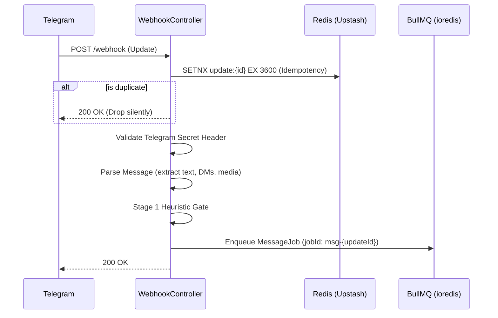
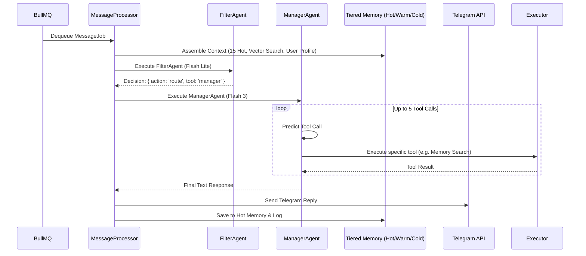

# Elena — Deep Dive: Architecture, Flows, and Security

This document provides a comprehensive technical analysis of Elena's internal architecture, control flows, and core logic as of **Phase 4**. It is intended for senior backend engineers to understand the system's operational design, security constraints, and extensibility patterns.

---

## 1. System Architecture Pipeline

Elena uses a highly decoupled, asynchronous architecture designed to ensure zero dropped messages, zero blocking of the webhook, and maximum availability even under high API latency from Gemini or Telegram.

### 1.1 Webhook to BullMQ (The "Web" Service)

**Key Engineering Decisions:**
- **Zero AI in Webhook:** The HTTP controller does absolutely no LLM inference. It validates, parses, enqueue, and terminates in `< 200ms`.
- **Atomic Idempotency:** Telegram retries webhooks if the server doesn't respond fast enough. The `SETNX` lock prevents accidental double-enqueues of the same update.
- **Fail-Fast Heuristics:** The heuristic gate discards noise (group chatter not mentioning Elena) before touching BullMQ, saving queue capacity.

---

### 1.2 Message Processing loop (The "Worker" Service)

The `Worker` service operates purely off BullMQ with concurrency set to 10 processing loops per chat ID.

---

## 2. Multi-Agent System

Elena routes intent via a hierarchy of models based on cognitive demand and speed.

| Agent | Model | Thinking Level | Primary Role |
|:---|:---|:---|:---|
| **Filter** | `gemini-3.1-flash-lite-preview` | None | Initial triage. Determines if the message should be ignored, replied to directly, or routed deeper. |
| **Manager** | `gemini-3-flash-preview` | Low | The orchestrator. Answers general questions and executes basic tools. Uses `delegate_task` to call specialists. |
| **Coder** | `gemini-3.1-pro-preview` | Low | High-context agent for syntax, bug fixing, and repo analysis. |
| **Reviewer**| `gemini-3.1-pro-preview` | Low | Code review specialist focusing on security and optimizations. |
| **Researcher**| `gemini-3-flash-preview` | Low | Web search synthesis via Serper API. |
| **Brainstorm**| `gemini-3.1-pro-preview` | High | Intense ideation, system design, and long-term planning. |

*Note: Sub-agents are executed as asynchronous functions within the same NodeJS tick by the Manager. They are NOT pushed back into BullMQ, which avoids queue deadlock scenarios.*

---

## 3. Tool Execution & Security Boundaries

The `ExecutorService` acts as the definitive security and safety barrier for all agent-initiated tool calls.

### 3.1 Validation and Auditing
- **Zod Schemas:** Every tool exposes an `argsSchema`. The executor validates the JSON from Gemini against this schema; if it fails, a hard validation error is returned to the agent without executing the tool.
- **Audit Logs:** Every successful or failed execution generates a sanitised `[TOOL_TRACE]` log and is recorded in the Postgres `AuditLog` table.

### 3.2 Human-in-the-Loop (HITL) Checkpointing
Destructive or highly sensitive tools (e.g., `approve_user`, `update_user_profile`, `run_code`) are marked with `requiresConfirmation: true`.

**How HITL prevents Rogue AI:**
1. Manager Agent calls `approve_user(userId: "123")`.
2. Executor flags `requiresConfirmation`.
3. Executor strips sensitive context, serializes the arguments, and stores them in Redis: `SET hitl:{jobId} payload EX 600`.
4. Executor sends a Telegram message: *"This action requires admin approval. Reply /confirm_{jobId}"*.
5. Executor returns `{ suspended: true }` to the Agent, effectively pausing that LLM thread gracefully.
6. A human Admin types `/confirm_{jobId}`.
7. Webhook fires, validates the Admin's role, and enqueues a `HITLResumeJob`.
8. `hitl.processor` atomically consumes the Redis key and executes the tool for real.

---

## 4. Multimodal Processing & "Pixel Truth"

Elena natively handles images, videos, and voice notes.

- **File Size Routing:**
  - `<= 10MB:` Downloaded to worker RAM, converted to Base64, and sent to Gemini as `inlineData`.
  - `>10MB & <=20MB:` Downloaded to `/tmp`, uploaded via Gemini File API, and the URL is passed to the context window.
  - `> 20MB:` Rejected at the webhook parser stage.
- **Visual Grounding:** When media is detected, the `PersonasInjector` overrides standard chat history reliance. An explicit system prompt is injected: *"VISUAL GROUNDING ACTIVE: Trust literal visual observation over chat history."*

---

## 5. Security Models (Phase 4 Hardened)

1. **Group-First Guard:** Unknown users attempting to DM Elena are silently ignored. Users must first be observed in an authorized group chat where they are atomically registered as a 'Guest'.
2. **Strict Role Checks:** Commands like `/clear` and HITL `/confirm` are gated by DB lookups ensuring the executor is an `admin`, `superadmin`, or the original `requesterId`.
3. **Hot Memory Lock Drops:** In conditions of high concurrency (spam), if the Redis lock `hot:lock:{chatId}` is contended, the worker will drop the write rather than risk corrupting the chat history array.
4. **Prompt Injection Guard:** All user display names and inputs embedded into System Prompts are scrubbed of newline characters and `ROLE:` prefixes via `sanitizeForPrompt()` to prevent jailbreaks.
5. **No Offline Queueing on Worker Container:** The BullMQ worker is strictly configured with `enableOfflineQueue: false`. If Upstash Redis drops connection, the worker fast-fails rather than buffering commands silently in memory.

---

## 6. What-If Scenarios & Edge Cases

### Scenario A: Network partition drops Postgres connection mid-tool
**Result:** The Prisma query fails throwing an exception. The `ExecutorService` catches it, records a failed `[TOOL_TRACE]` log, and returns `{ success: false, error: "Database timeout" }` back to the Agent. The Agent sees the error and can apologize to the user. The worker does not crash.

### Scenario B: A user sends 40 images of 15MB at the same time
**Result:** Telegram sends 40 webhooks. WebhookController accepts them all instantly. BullMQ queues 40 jobs.
Because Cloud Run worker memory is capped at `2Gi`, processing 40 x 15MB streams concurrently could cause an OOM (`OOMKilled`) hard restart.
To prevent this, concurrency on the `elena-messages` queue is set to a safe limit. Completed temporary files in `/tmp` are `fs.unlink()`'d immediately in `finally` blocks.

### Scenario C: Gemini "forgets" it is an AI and tries to format an unescaped markdown chunk
**Result:** Telegram's API strictly rejects malformed `MarkdownV2` (e.g., an unescaped `. `or `-`).
The `ReplySenderService` catches the Telegram 400 error, falls back to raw text, strips ALL markdown, sends the message as plaintext, and logs a format violation warning. The user still gets their answer.

### Scenario D: The Manager Agent gets stuck in a loop calling a failing API
**Result:** `BaseAgent` has a hard-coded `MAX_TOOL_CALLS = 5`. On the 5th iteration, the loop terminates forcefully and returns a meta-response to the user: *"The task reached the maximum execution limit... I've stopped here to prevent a loop."*

### Scenario E: Two admins click "Approve" on a new user at the exact same millisecond
**Result:** Telegram sends two callback queries.
The `WebhookController` handles both. However, the `ProfileBuilder` service queries the `OnboardingSession` table FIRST. If the status is not `pending`, the second query immediately no-ops. One succeeds, one is quietly dropped.

### Scenario F: The Serverless Redis Connection drops silently while the idle Worker is waiting
**Result (`app.module.ts` + `bullmq`):**
If a local ISP or Upstash violently drops the TCP connection, `bullmq`'s blocking queue listener (`bzpopmin`) throws a fatal error.
Because the worker is strictly configured with `enableOfflineQueue: false` (to prevent silent memory OOM buffering), `ioredis` instantly throws `Stream isn't writeable and enableOfflineQueue options is false`. This causes the worker's internal retry loop to spin aggressively, throwing red logs in the terminal until the Redis socket successfully re-handshakes. The node process survives, and recovering the connection resolves the loop.

---

## 7. Memory Tiers

1. **Hot (Redis):** Array of objects `{ role, text, date }`. Sliding window of 15 interactions. TTL 2 Hours. Fast, sequential conversational memory.
2. **Warm (Qdrant Cloud):** Every outgoing bot response and significant user message is chunked, embedded via `gemini-embedding-001`, and stored in Qdrant. Retrieved dynamically when the `memory_search` tool is invoked.
3. **Cold (Supabase PostgreSQL):** Relational state. Holds the definitive source of truth for User Roles, Bounties, Audit Logs, and pending HITL tasks.

---

## 8. Identity & Access Control — Roles & Claim Logic

Elena uses a hierarchical role system to manage permissions and notifications.

| Role | Default? | Max Capacity | How to Claim |
| :--- | :--- | :--- | :--- |
| **Guest** | **YES** | Unlimited | Assigned automatically to any new user interacting with Elena in a group. |
| **Member** | No | Unlimited | Promoted from Guest after passing the onboarding interview and receiving approval from a Founder. |
| **Admin** | No | 2 | Claimed via `/claim-admin` command. User must be an already approved **Member**. |
| **Superadmin** | No | 1 | Claimed via `/claim-admin` command. Only works if 0 superadmins exist in the DB. |

### Role Behaviors
- **Superadmin:** Has full control. Automatically marked as a `isFoundingMember` upon claiming. Receives all squad application notifications.
- **Admin:** Tiered administrative access. Receives squad application notifications.
- **Member:** Full access to Elena's bounty and research tools. Can participate in group and DM discussions.
- **Guest:** Read-only/Banter access in groups. Limited onboarding interaction. DMs are ignored until they join a group first (Group-First Guard).

---

## 9. Deep Logic: Identity & Environment

### 1. Memory Persistence vs. Contextual Resets
Elena’s memory is multi-tiered to balance efficiency and recognition:
*   **Hot Memory (Ephemeral):** Keyed strictly by `chatId`. Moving Elena to a new group triggers a **Contextual Reset**. She restarts her short-term understanding of the current thread.
*   **Cold Memory (Global):** Keyed by `telegramId`. Elena’s recognition of **People** is global across all groups. She retains their roles, personas, and technical preferences.

### 2. User Metadata Visibility
Agents do not just see text; they receive a high-fidelity information packet in their `systemInstruction`:
*   **Native Metadata:** `userId`, `displayName`, `username`.
*   **Identity Layer:** `role` (superadmin/admin/member/guest), `onboardingStatus`.
*   **Persona Layer:** `personaJson` (notes on technical tone/vibe).
*   **Contextual Layer:** `replyToContext` (the message being replied to), `hasMedia` (flag for silent images).
